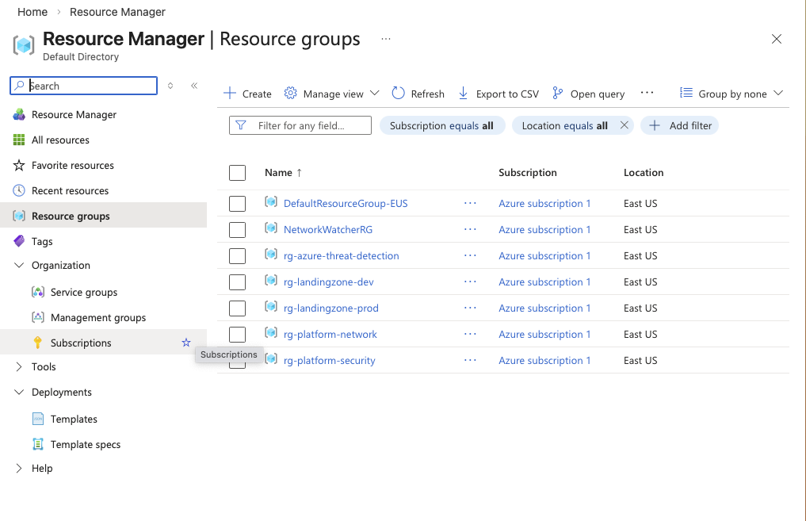
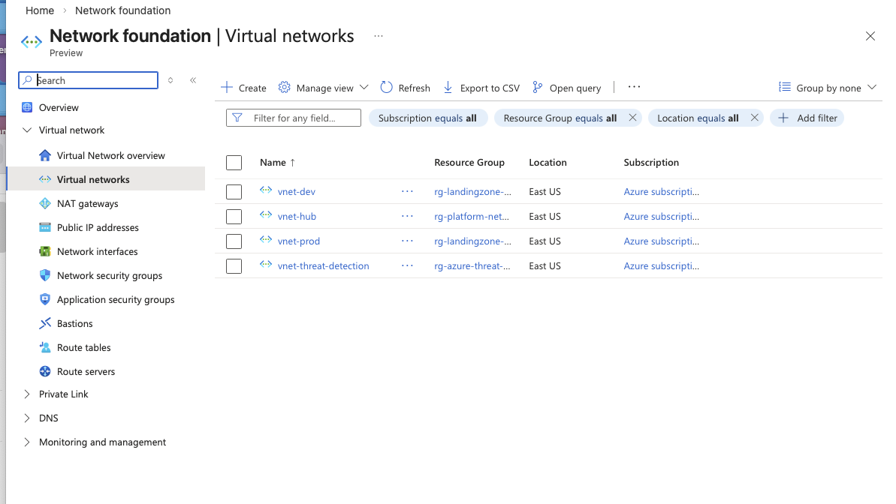
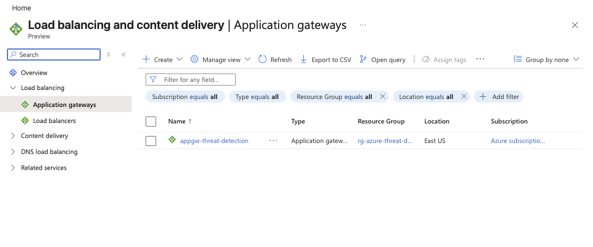
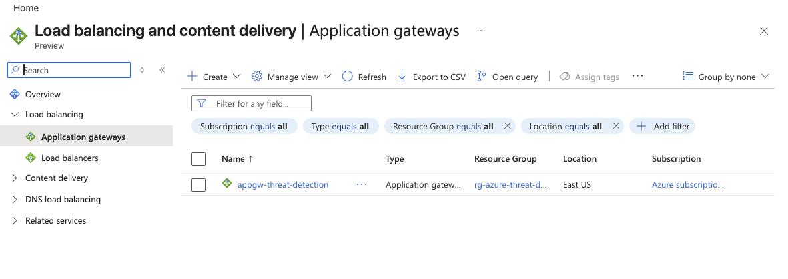
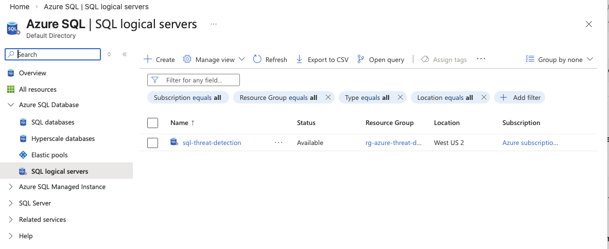
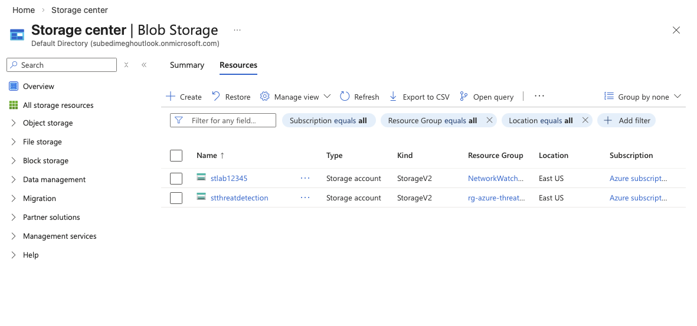
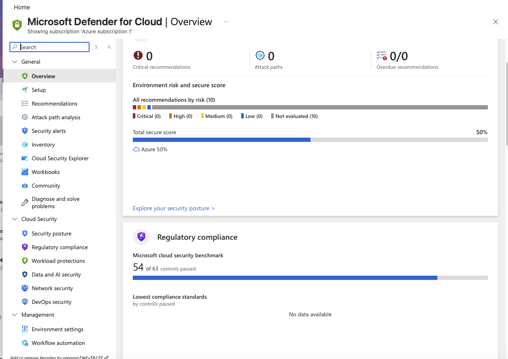
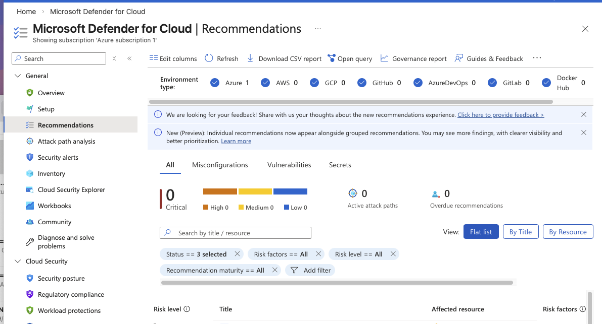
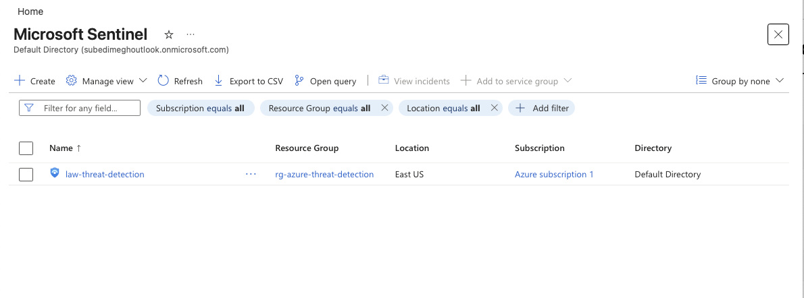
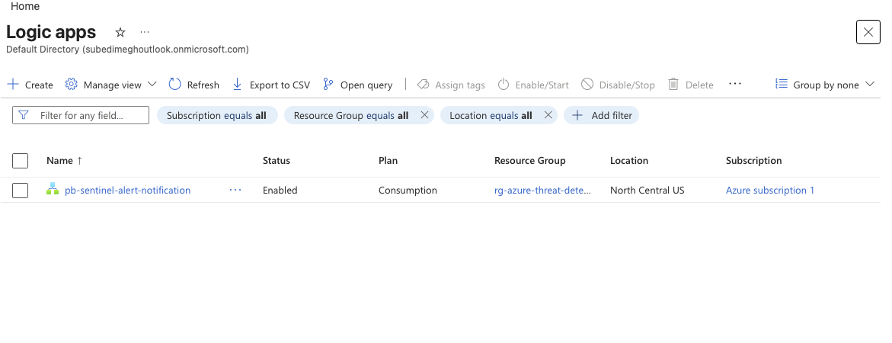

# Azure Threat Detection Architecture

## Overview

This project demonstrates a cloud-native threat detection architecture built using Microsoft Azure security services. The goal of this project is to showcase how a security engineer designs centralized logging, monitoring, and detection pipelines for cloud workloads.

The environment integrates Microsoft Defender for Cloud, Azure Log Analytics, and Microsoft Sentinel to collect telemetry from cloud resources, analyze security events, and generate actionable alerts.

The project focuses on security monitoring concepts and detection engineering within a cloud environment.

---

## Architecture

Internet  
↓  
Application Gateway (WAF)  
↓  
Azure Virtual Network  
↓  
Workload Resources (Virtual Machine, SQL Database, Storage)  
↓  
Microsoft Defender for Cloud  
↓  
Log Analytics Workspace  
↓  
Microsoft Sentinel  
↓  
Analytics Detection Rule  
↓  
Automation (Logic App)

---

## Infrastructure Components

### Resource Group

```
rg-azure-threat-detection
```

All resources were deployed inside a single resource group.  
This simplifies management and allows the entire environment to be removed quickly to prevent ongoing cloud costs.

---

## Networking Layer

### Virtual Network

```
vnet-threat-detection
```

Subnets:

| Subnet | Purpose |
|------|------|
| appgw-subnet | Application Gateway |
| default | Workload resources |

The virtual network isolates the infrastructure and provides a secure communication boundary.

---

## Edge Security

### Application Gateway (WAF)

Azure Application Gateway provides:

- Layer 7 load balancing
- Web Application Firewall (WAF)
- HTTP/HTTPS traffic inspection

It acts as the first defensive layer protecting workloads from internet traffic.

---

## Workload Layer

### Virtual Machine

```
vm-threat-detection
```

Purpose:

- generate authentication activity
- produce logs for security monitoring

---

### Azure SQL Database

```
sqldb-threat-detection
```

Represents a managed database workload monitored through Defender for Cloud.

---

### Storage Account

```
stthreatdetection
```

Represents cloud storage services monitored for security posture and configuration risks.

---

## Security Monitoring

### Microsoft Defender for Cloud

Microsoft Defender for Cloud provides:

- cloud security posture management
- security recommendations
- workload protection

It evaluates deployed resources and highlights potential risks such as exposed services or insecure configurations.

---

## Log Analytics Workspace

```
law-threat-detection
```

The Log Analytics workspace acts as the centralized logging platform.

Telemetry collected includes:

- virtual machine logs
- Azure resource activity
- security alerts

Logs are analyzed using Kusto Query Language (KQL).

---

## SIEM Platform

### Microsoft Sentinel

Microsoft Sentinel is used as the Security Information and Event Management (SIEM) platform.

Capabilities include:

- threat detection
- security analytics
- incident investigation
- centralized monitoring

Sentinel analyzes telemetry stored in the Log Analytics workspace to identify suspicious behavior.

---

## Detection Engineering

### Detection Rule

```
VM-Suspicious-Login-Detection
```

### Detection Logic

Detect multiple failed authentication attempts within a short time window.

### KQL Query

```kql
Syslog
| where SyslogMessage contains "Failed password"
| summarize FailedAttempts=count() by HostName, bin(TimeGenerated, 5m)
| where FailedAttempts > 5
```

### MITRE ATT&CK Mapping

Credential Access – Brute Force (T1110)

---

## Security Automation

### Logic App Playbook

Automation was implemented using Azure Logic Apps.

Purpose:

- respond automatically to Sentinel alerts
- trigger notification or investigation workflows

Automation flow:

Sentinel Alert  
↓  
Incident Created  
↓  
Automation Rule  
↓  
Logic App Playbook

---

## Detection Pipeline

Workload Activity  
↓  
Logs Generated  
↓  
Log Analytics Workspace  
↓  
Sentinel Analytics Rule  
↓  
Security Incident Created  
↓  
Automation Playbook Triggered

---

## Screenshots

The repository includes screenshots demonstrating:

- resource deployment
- virtual network configuration
- application gateway WAF
- Defender for Cloud dashboard
- Microsoft Sentinel workspace
- Logic App automation playbook

Sensitive identifiers such as subscription IDs and tenant details have been removed.

---

## Skills Demonstrated

This project demonstrates knowledge of:

- cloud security architecture
- SIEM implementation
- detection engineering
- KQL log analysis
- cloud security posture monitoring
- security automation workflows

---

## Cost Management

All resources were deployed inside:

```
rg-azure-threat-detection
```

After completing the deployment, the resource group was deleted to avoid ongoing costs.

---
## Screenshots

### Resource Group Overview


### Virtual Network


### Application Gateway (WAF)


### Virtual Machine


### SQL Database


### Storage Account


### Defender for Cloud Dashboard


### Defender Recommendations


### Microsoft Sentinel Overview


### Logic App Automation Playbook

